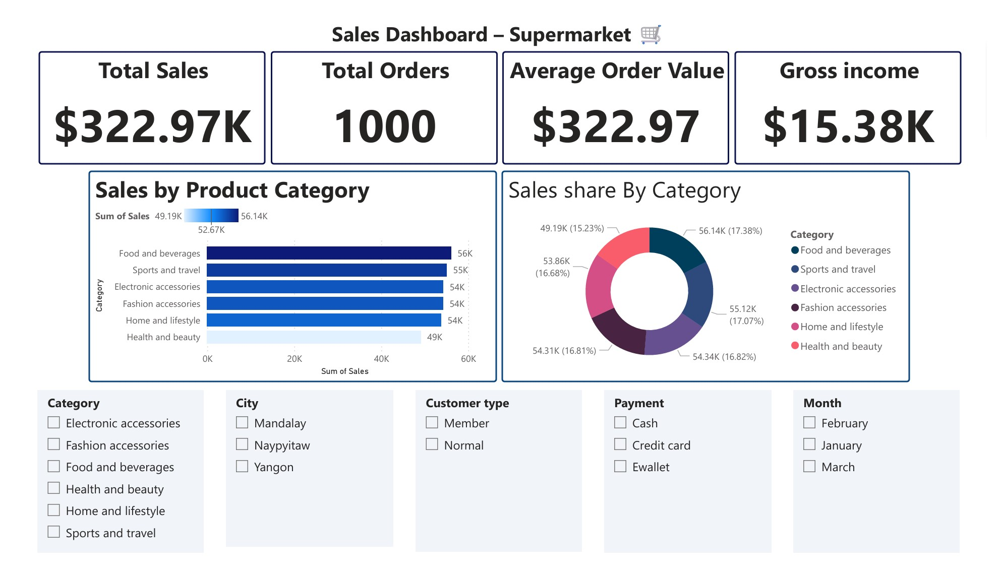
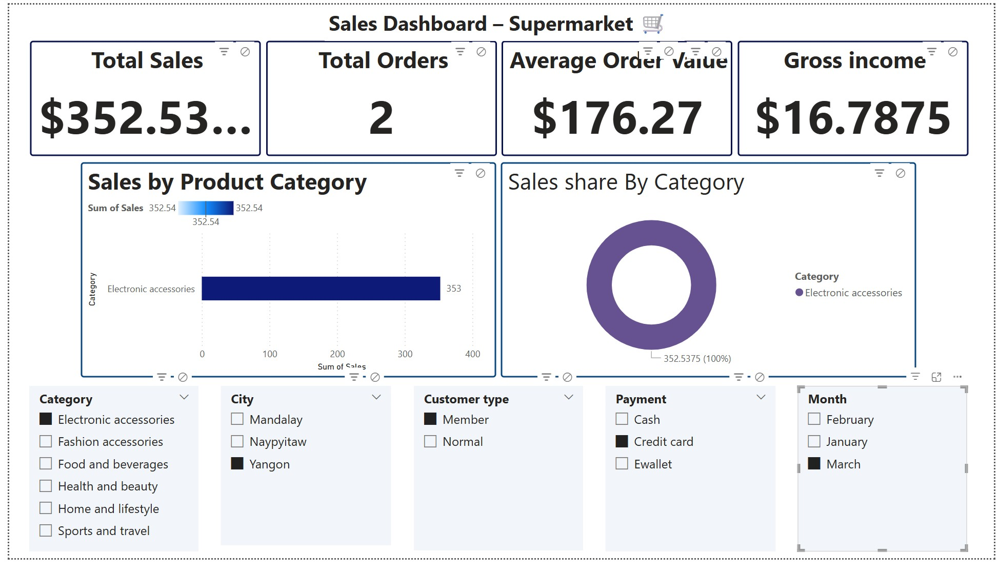
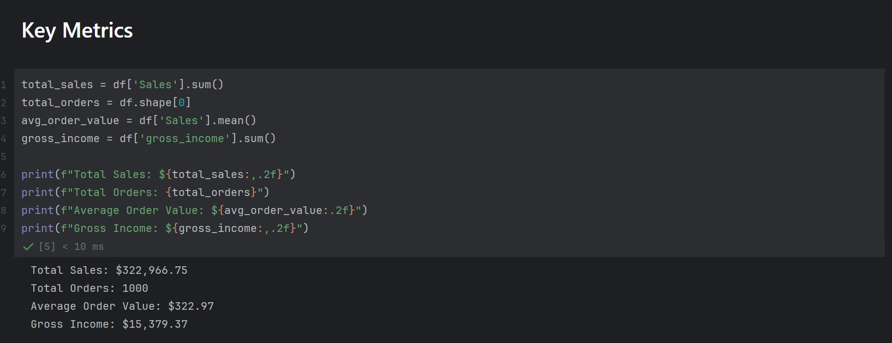
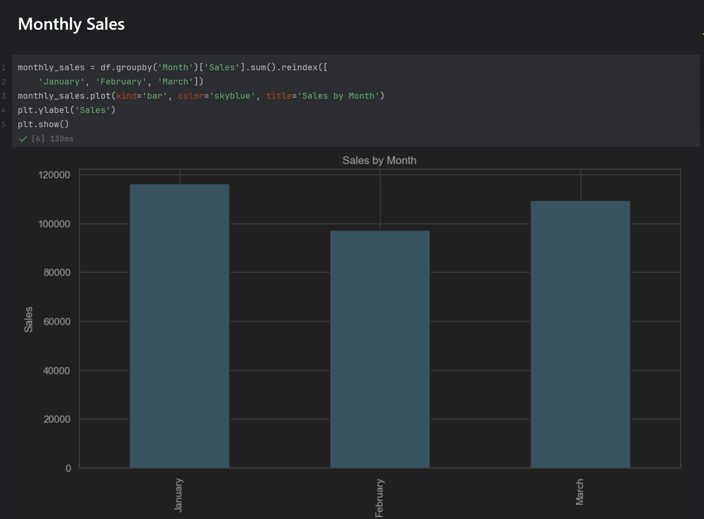
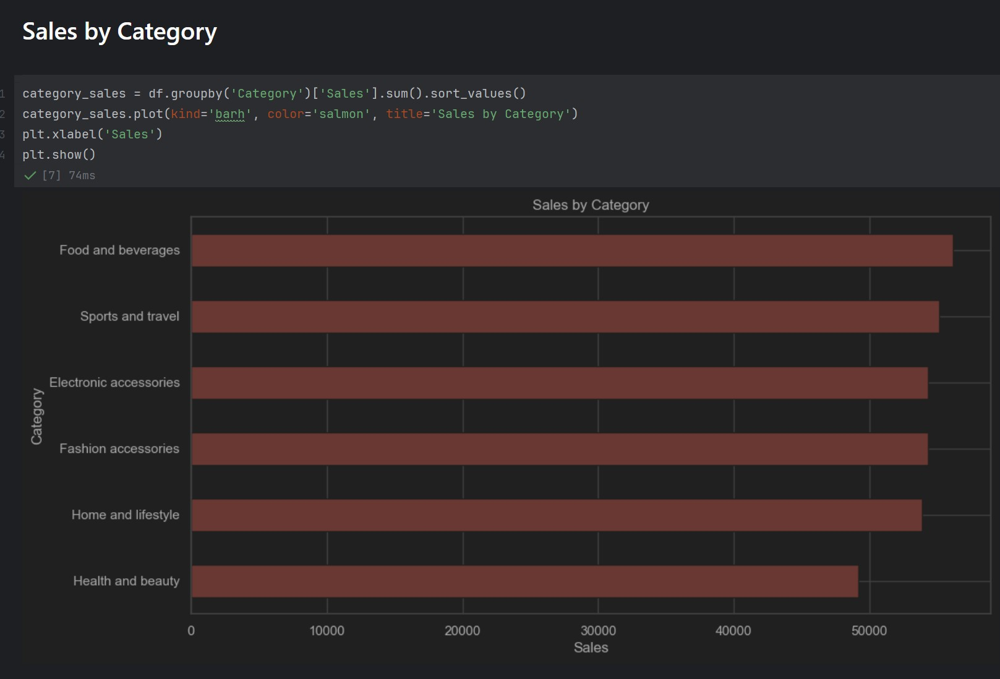
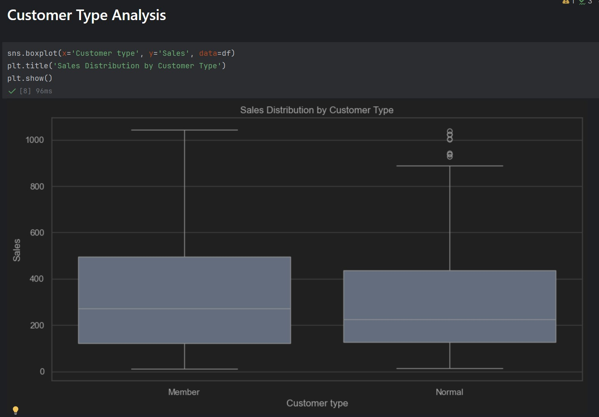
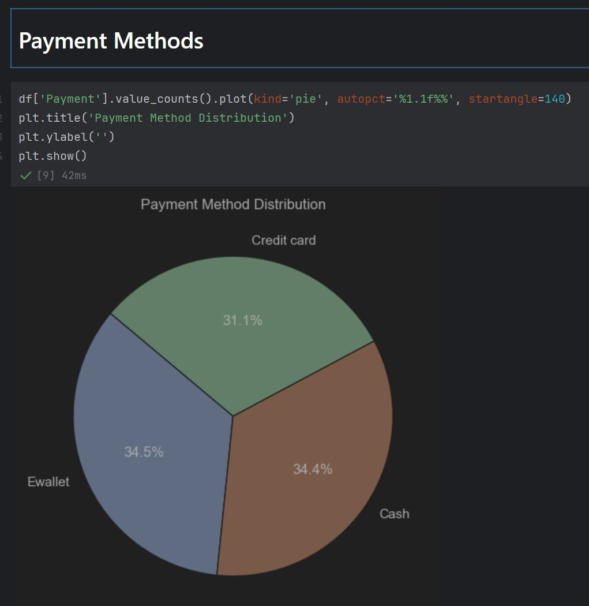

# Supermarket Sales Dashboard 🛍️📊

This project showcases a full analysis of supermarket sales data using Python and Power BI. It demonstrates end-to-end data analytics skills, including data cleaning, visualization, and interactive dashboard design.

---

## 🚀 Tools & Skills

- Python (pandas, matplotlib, seaborn)
- Power BI
- Git & GitHub
- Data storytelling & KPIs

---

## 📁 Project Structure

```
supermarket-data-project/
│
├── data/
│   └── supermarket_sales_cleaned.csv
│
├── notebooks/
│   └── supermarket_analysis.ipynb
│
├── dashboard/
│   └── supermarket_dashboard.pbix
│
├── screenshots/
│   ├── dasboard-supermarkt.jpg
│   ├── dasboard-supermarkt2.jpg
│   ├── key-metrics.jpg
│   ├── monthly_sales.jpg
│   ├── sales_by_category.jpg
│   ├── customer_type.jpg
│   └── payment_methods.jpg
│
└── README.md
```

---

## 📊 Dashboard Preview

### Full Dashboard


### Filtered Example


---

## 📌 Additional Visuals (Python)

### Key Metrics


### Monthly Sales


### Sales by Category


### Customer Type Analysis


### Payment Method Distribution


---

## ✉️ Contact
📧 hamedfallah7007@gmail.com  
🔗 [GitHub](https://github.com/soccerwave)
